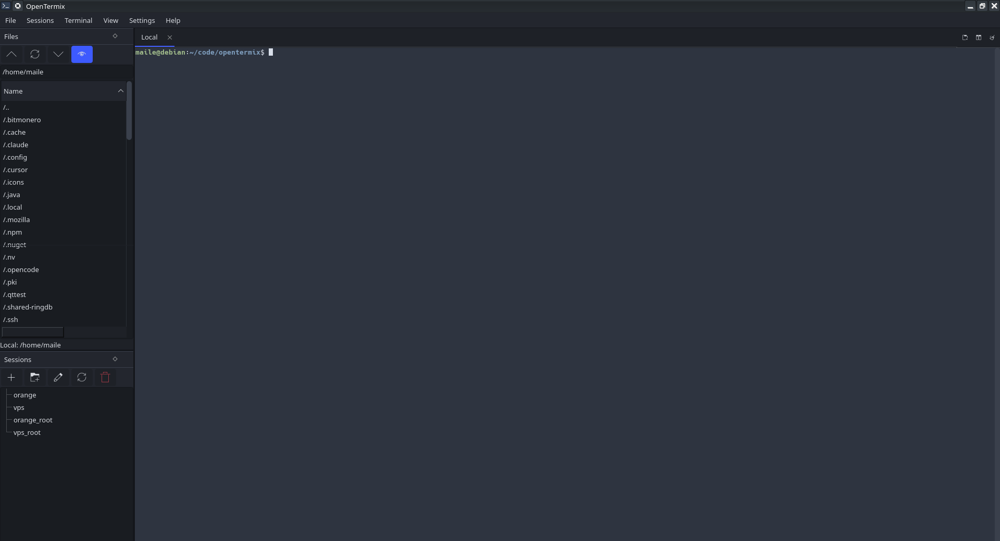

# OpenTermix

*Read this in other languages: [Русский](README.ru.md).*

OpenTermix is an open-source, lightweight MobaXterm-like terminal for Linux.
It focuses on speed, a minimal ergonomic UI, and native integration with your
existing SSH setup.

Built with **Qt 6** (C++ in a deliberately simple, C-like style),
[QTermWidget](https://github.com/lxqt/qtermwidget) for the embedded terminal,
and [libssh](https://www.libssh.org/) for the SFTP browser.



## Features (MVP - SSH core)

- Tabbed embedded terminal (local shell and SSH), running your system shell.
- Split view: 1 / 2 / 4 terminals per tab.
- Multi-execution: broadcast keystrokes to every open terminal at once.
- Detach a tab into its own window.
- Reads and writes `~/.ssh/config`:
  - session tree grouped into folders (stored as per-host `# OpenTermix-Group:`
    comments, so grouping never reorders the Host blocks in your config),
  - graphical add/edit dialog with required fields marked and validated,
  - a timestamped backup is made before the config is rewritten.
- Built-in SFTP file browser (drag files in to upload, download selection).
- Light/dark themes, configurable terminal font, persisted window layout.

Deferred for later phases: VNC, embedded X11 server, RDP/Telnet/Serial/Mosh,
SSH tunnel manager, dev tools (editor, keygen, diff, macros), password manager,
cross-platform packaging. X11 forwarding still works through `ssh -X`.

## Build (Linux)

### Dependencies

- CMake >= 3.18, a C++17 compiler
- Qt 6 (Widgets)
- `qtermwidget6` (development package)
- `libssh` (development package)

On Debian (trixie/sid) / recent Ubuntu:

```bash
sudo apt install cmake g++ qt6-base-dev libqtermwidget-dev libutf8proc-dev libssh-dev
```

Notes:
- The Qt6 qtermwidget dev package is `libqtermwidget-dev` (it provides the
  `qtermwidget6` pkg-config module). On some distributions it is named
  `libqtermwidget6-dev`.
- `libutf8proc-dev` is required because `qtermwidget6.pc` lists it as a
  dependency.

### Compile

```bash
cmake -B build -DCMAKE_BUILD_TYPE=Release
cmake --build build -j
./build/opentermix
```

### Build a .deb package

The `debian/` directory holds a standard `debhelper` packaging setup. Install
the packaging toolchain in addition to the build dependencies above, then
build from the repository root:

```bash
sudo apt install debhelper cmake g++ qt6-base-dev qt6-tools-dev qt6-l10n-tools \
                 libqtermwidget-dev libutf8proc-dev libssh-dev
dpkg-buildpackage -us -uc -b
```

This writes `opentermix_<version>_amd64.deb` (plus `.buildinfo`/`.changes`) to
the parent directory. Install it with:

```bash
sudo dpkg -i ../opentermix_*_amd64.deb
```

## Layout

```
src/
  app/        MainWindow: docks, menus, theme; SettingsWidget
  terminal/   TerminalWidget, TerminalGroup, TerminalArea (VS Code-like groups), MultiExec
  sessions/   Session, SshConfigParser, SessionTreeModel, SessionPanel, editor
  sftp/       SftpClient (libssh worker thread), SftpBrowserWidget
resources/    QSS themes + .qrc
```

## Localisation

The UI is translatable via Qt Linguist. Translations live in `translations/`
and are compiled to `.qm` and embedded under the `:/i18n` resource prefix; the
matching translation for the system locale is loaded at startup.

Shipped locales: English (source), Russian (`translations/opentermix_ru.ts`).

To add a new locale (for example French, `fr`):

1. Add the file to `OPENTERMIX_TS_FILES` in `CMakeLists.txt`:
   `translations/opentermix_fr.ts`.
2. Generate/refresh the translation catalogue from the sources:
   ```bash
   /usr/lib/qt6/bin/lupdate -recursive src -ts translations/opentermix_fr.ts
   ```
   (or, after configuring, `cmake --build build --target update_translations`).
3. Translate the strings (edit the `.ts` in Qt Linguist or by hand).
4. Rebuild - the `.qm` is compiled and embedded automatically.

## Notes

- SFTP authentication in this MVP uses your SSH agent or on-disk keys only.
  Password auth is planned together with the password manager.
- An unknown host key is stored automatically; a *changed* key aborts the
  connection.

## License

OpenTermix is licensed under the GNU General Public License v3.0 or later
(GPL-3.0-or-later). See [LICENSE](LICENSE) for the full text.
